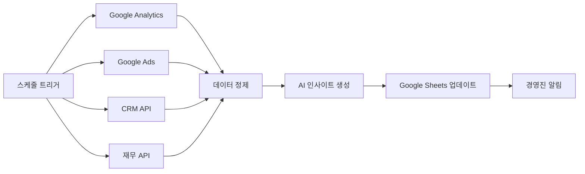

# n8n 워크플로우 자동화 세미나

## 실무 중심 3시간 완성 가이드

---

## 📋 세미나 개요

**시간** : 3시간 (180분)

**목표** : 업무 자동화를 위한 n8n 실무 활용 능력 습득

**대상** : 반복 업무가 많은 모든 직군 (개발자, 기획자, 운영자 등)

### 🎯 학습 목표

- n8n 기본 개념 및 노드 시스템 이해
- Google Sheets, Excel 연동 자동화 구현
- 웹 데이터 수집 및 처리 자동화
- AI 기능을 활용한 지능형 워크플로우 구축
- 실무에 즉시 적용 가능한 4가지 유스케이스 완성

---

## ⏰ 세미나 일정

| 시간          | 내용                                  | 형태        |
| ------------- | ------------------------------------- | ----------- |
| **0:00-0:20** | n8n 기초 개념 및 환경 설정            | 이론 + 실습 |
| **0:20-1:00** | 기본 워크플로우 및 Google Sheets 연동 | 실습        |
| **1:00-1:40** | 웹 스크래핑 및 데이터 처리 자동화     | 실습        |
| **1:40-2:20** | AI 노드 활용 및 지능형 자동화         | 실습        |
| **2:20-3:00** | 실무 유스케이스 구현 및 Q&A           | 실습 + 토론 |

---

## 🚀 1부: n8n 기초 및 환경 설정 (20분)

### n8n이란?

**n8n**은 "노드 투 노드(node to node)"의 줄임말로, 시각적 워크플로우 자동화 플랫폼입니다.

#### 🔍 핵심 개념

- **노드(Node)** : 각각의 작업 단위 (API 호출, 데이터 변환, 조건 분기 등)
- **워크플로우(Workflow)** : 노드들을 연결한 자동화 프로세스
- **트리거(Trigger)** : 워크플로우를 시작하는 조건
- **액션(Action)** : 실제 작업을 수행하는 노드

#### 💡 n8n의 장점

```
✅ 코딩 없이 복잡한 자동화 구현
✅ 400+ 서비스 연동 지원
✅ 온프레미스/클라우드 모두 지원
✅ 무료 오픈소스 (셀프호스팅)
✅ 직관적인 시각적 인터페이스
```

### 🛠️ 실습 1: 환경 설정 및 첫 워크플로우

#### Step 1: n8n 접속

1. **클라우드 버전** : https://app.n8n.cloud 회원가입
2. **데스크톱 버전** : https://n8n.io/download (선택사항)

#### Step 2: 첫 번째 워크플로우 만들기

```
목표: "Hello World" 메시지를 Webhook으로 받아 응답하기
```

**노드 구성:**

1. **Webhook** 노드 (트리거)
   - HTTP Method: `GET`
   - Path: `/hello`
2. **Set** 노드 (데이터 변환)
   ```json
   {
     "message": "Hello World from n8n!",
     "timestamp": "{{$now}}",
     "source": "n8n automation"
   }
   ```
3. **Respond to Webhook** 노드 (응답)
   - Response Body: `{{$json}}`

#### 💻 실습 코드

```bash
# 테스트 URL (워크플로우 실행 후 생성됨)
curl https://your-n8n-instance.app.n8n.cloud/webhook/hello
```

**기대 결과:**

```json
{
  "message": "Hello World from n8n!",
  "timestamp": "2024-11-06T10:30:00.000Z",
  "source": "n8n automation"
}
```

---

## 📊 2부: Google Sheets 연동 마스터 (40분)

### 🎯 실습 2: 실시간 Google Sheets 데이터 동기화

#### 시나리오

```
매출 데이터를 Google Sheets에 자동으로 기록하고,
일정 금액 이상일 때 알림을 보내는 시스템
```

#### Step 1: Google Sheets 준비

**샘플 시트 구조:**

| A          | B      | C     | D      | E    |
| ---------- | ------ | ----- | ------ | ---- |
| 날짜       | 고객명 | 상품  | 금액   | 상태 |
| 2024-11-06 | 김철수 | 상품A | 150000 | 완료 |

#### Step 2: 워크플로우 구성

**노드 1: Webhook (데이터 수신)**

```json
// POST 요청으로 받을 데이터 구조
{
  "customer_name": "김철수",
  "product": "상품A",
  "amount": 150000,
  "status": "완료"
}
```

**노드 2: Set (데이터 정리)**

```javascript
// 한국 시간으로 날짜 설정 및 데이터 구조화
return {
  date: new Date().toLocaleDateString('ko-KR'),
  customer_name: $json.customer_name,
  product: $json.product,
  amount: parseInt($json.amount),
  status: $json.status || '진행중',
};
```

**노드 3: Google Sheets (데이터 추가)**

- **Operation** : `Append`
- **Spreadsheet ID** : 구글 시트 URL에서 추출
- **Sheet** : `매출관리`
- **Range** : `A:E`

**노드 4: IF 조건 분기**

```javascript
// 10만원 이상일 때만 알림
return $json.amount >= 100000;
```

**노드 5: Webhook (Slack 알림)**

```json
{
  "text": "🎉 대형 거래 발생!\n고객: {{$node['Set'].json['customer_name']}}\n금액: {{$node['Set'].json['amount']}}원"
}
```

#### 🧪 테스트 데이터

```bash
curl -X POST https://your-webhook-url \
  -H "Content-Type: application/json" \
  -d '{
    "customer_name": "이영희",
    "product": "프리미엄 패키지",
    "amount": 250000,
    "status": "완료"
  }'
```

### 🔄 실습 3: Google Sheets 데이터 읽기 및 처리

#### 시나리오: 고객 데이터 분석 및 등급 자동 업데이트

**워크플로우:**

**노드 1: Schedule Trigger (매일 오전 9시)**

- **Trigger Times** : `0 9 * * *`

**노드 2: Google Sheets (데이터 읽기)**

- **Operation** : `Read`
- **Range** : `A:E`
- **Header Row** : `Yes`

**노드 3: Code (고객 등급 계산)**

```javascript
const customers = $input.all();
const processedData = [];

for (const customer of customers) {
  const amount = parseInt(customer.json.amount || 0);
  let grade = 'Bronze';

  if (amount >= 500000) grade = 'Platinum';
  else if (amount >= 200000) grade = 'Gold';
  else if (amount >= 100000) grade = 'Silver';

  processedData.push({
    ...customer.json,
    grade: grade,
    updated_at: new Date().toISOString(),
  });
}

return processedData;
```

**노드 4: Google Sheets (등급 업데이트)**

- **Operation** : `Update`
- **Range** : `F:G` (등급, 업데이트 시간 컬럼)

---

## 🌐 3부: 웹 스크래핑 및 데이터 처리 (40분)

### 🎯 실습 4: 경쟁사 가격 모니터링 시스템

#### 시나리오

```
경쟁사 웹사이트에서 제품 가격을 주기적으로 수집하여
Google Sheets에 저장하고, 가격 변동 시 알림
```

#### Step 1: 기본 웹 스크래핑 워크플로우

**노드 1: Schedule Trigger**

- **Trigger Times** : `0 */6 * * *` (6시간마다)

**노드 2: HTTP Request**

```
Method: GET
URL: https://example-competitor.com/products/smartphone
Headers:
  User-Agent: Mozilla/5.0 (Windows NT 10.0; Win64; x64) AppleWebKit/537.36
```

**노드 3: HTML Extract**

```javascript
// CSS 선택자를 사용한 데이터 추출
{
  "product_name": ".product-title",
  "price": ".price-current",
  "availability": ".stock-status",
  "last_updated": ".update-time"
}
```

**노드 4: Code (데이터 정리)**

```javascript
const data = $json;

// 가격에서 숫자만 추출
const price = data.price.replace(/[^0-9]/g, '');

// 재고 상태 표준화
const availability = data.availability.includes('재고') ? '재고있음' : '품절';

return {
  product_name: data.product_name.trim(),
  price: parseInt(price),
  availability: availability,
  crawled_at: new Date().toISOString(),
  source_url: 'https://example-competitor.com/products/smartphone',
};
```

#### Step 2: 가격 변동 감지 로직

**노드 5: Google Sheets (이전 가격 조회)**

- **Operation** : `Lookup`
- **Lookup Column** : `A` (상품명)
- **Lookup Value** : `{{$json.product_name}}`

**노드 6: IF (가격 변동 체크)**

```javascript
const currentPrice = $json.price;
const previousPrice = $node['Google Sheets'].json.price;

// 가격이 5% 이상 변동되었을 때만 알림
const changePercent = Math.abs(
  ((currentPrice - previousPrice) / previousPrice) * 100
);
return changePercent >= 5;
```

**노드 7: 알림 분기**

**변동 있음 → Slack 알림:**

```json
{
  "text": "💰 가격 변동 알림\n상품: {{$json.product_name}}\n이전: {{$node['Google Sheets'].json.price}}원\n현재: {{$json.price}}원\n변동률: {{((($json.price - $node['Google Sheets'].json.price) / $node['Google Sheets'].json.price) * 100).toFixed(2)}}%"
}
```

**변동 없음 → Google Sheets 업데이트만:**

- **Operation** : `Update`
- **Data** : 최신 크롤링 데이터

#### 🔧 고급 스크래핑 기법

**1. 동적 콘텐츠 처리 (JavaScript 렌더링)**

```javascript
// HTTP Request 노드에서 JavaScript 실행이 필요한 경우
// Puppeteer 또는 Playwright 활용 (별도 서비스 필요)
```

**2. 에러 처리 및 재시도**

```javascript
// Code 노드에서 에러 핸들링
try {
  const price = $json.price_element.replace(/[^0-9]/g, '');
  if (!price) throw new Error('가격 정보를 찾을 수 없습니다');
  return { price: parseInt(price), status: 'success' };
} catch (error) {
  return {
    price: null,
    status: 'error',
    error_message: error.message,
    retry_count: ($json.retry_count || 0) + 1,
  };
}
```

**3. 다중 페이지 크롤링**

```javascript
// 여러 상품 페이지를 순회하며 데이터 수집
const productUrls = [
  'https://competitor.com/product1',
  'https://competitor.com/product2',
  'https://competitor.com/product3',
];

return productUrls.map((url) => ({ url }));
```

---

## 🤖 4부: AI 노드 활용 및 지능형 자동화 (40분)

### 🎯 실습 5: AI 기반 스마트 이메일 처리 시스템

#### 시나리오

```
고객 문의 이메일을 자동으로 분석하여
- 감정 분석 (긍정/부정/중립)
- 카테고리 분류 (기술지원/판매/환불/기타)
- 우선순위 설정 (긴급/보통/낮음)
- 자동 답변 초안 생성
```

#### Step 1: 이메일 수신 및 전처리

**노드 1: Gmail Trigger**

- **Event** : `message.received`
- **Label** : `고객문의` (또는 `Inbox`)

**노드 2: Set (이메일 데이터 정리)**

```javascript
return {
  from: $json.payload.headers.find((h) => h.name === 'From').value,
  subject: $json.payload.headers.find((h) => h.name === 'Subject').value,
  body: $json.snippet || $json.payload.parts?.[0]?.body?.data,
  received_at: new Date($json.internalDate).toISOString(),
};
```

#### Step 2: AI 분석 노드들

**노드 3: OpenAI (감정 분석)**

```
Model: gpt-3.5-turbo
System Message:
"다음 이메일의 감정을 분석하여 '긍정', '부정', '중립' 중 하나로 분류하고,
신뢰도(0-100)를 함께 제공해주세요.
응답 형식: {'sentiment': '감정', 'confidence': 신뢰도숫자}"

User Message:
"제목: {{$json.subject}}
내용: {{$json.body}}"
```

**노드 4: OpenAI (카테고리 분류)**

```
System Message:
"이메일을 다음 카테고리로 분류해주세요:
- 기술지원: 제품 사용법, 오류, 설치 문제
- 판매문의: 가격, 구매, 견적 요청
- 환불요청: 취소, 반품, 환불 관련
- 제품문의: 기능, 스펙, 호환성
- 기타: 위에 해당하지 않는 경우

응답 형식: {'category': '카테고리명', 'confidence': 신뢰도숫자}"
```

**노드 5: Code (우선순위 계산)**

```javascript
const sentiment = $node['OpenAI'].json.message.content;
const category = $node['OpenAI1'].json.message.content;

let priority = '보통';
let urgencyScore = 0;

// 감정 분석 기반 점수
if (sentiment.includes('부정')) urgencyScore += 3;
else if (sentiment.includes('중립')) urgencyScore += 1;

// 카테고리 기반 점수
if (category.includes('환불요청')) urgencyScore += 3;
else if (category.includes('기술지원')) urgencyScore += 2;
else if (category.includes('판매문의')) urgencyScore += 1;

// 제목에서 긴급성 키워드 검색
const urgentKeywords = ['긴급', '빨리', '급함', '오류', '문제', '안됨'];
const subject = $node['Set'].json.subject.toLowerCase();
if (urgentKeywords.some((keyword) => subject.includes(keyword))) {
  urgencyScore += 2;
}

// 우선순위 결정
if (urgencyScore >= 5) priority = '긴급';
else if (urgencyScore >= 3) priority = '높음';
else if (urgencyScore <= 1) priority = '낮음';

return {
  sentiment: sentiment,
  category: category,
  priority: priority,
  urgency_score: urgencyScore,
  keywords_found: urgentKeywords.filter((k) => subject.includes(k)),
};
```

#### Step 3: 자동 답변 생성

**노드 6: OpenAI (답변 초안 생성)**

```
System Message:
"당신은 고객 서비스 전문가입니다. 다음 고객 이메일에 대한 정중하고 도움이 되는 답변 초안을 작성해주세요.

답변 가이드라인:
- 고객의 감정을 이해하고 공감 표현
- 구체적이고 실용적인 해결책 제시
- 필요시 추가 문의 방법 안내
- 정중하고 전문적인 톤 유지

고객 정보:
- 감정: {{$json.sentiment}}
- 문의 카테고리: {{$json.category}}
- 우선순위: {{$json.priority}}

원본 이메일:
제목: {{$node['Set'].json.subject}}
내용: {{$node['Set'].json.body}}"
```

#### Step 4: 데이터 저장 및 알림

**노드 7: Google Sheets (문의 로그 저장)**

```javascript
// 저장할 데이터 구조
return {
  received_at: $node['Set'].json.received_at,
  from: $node['Set'].json.from,
  subject: $node['Set'].json.subject,
  sentiment: $json.sentiment,
  category: $json.category,
  priority: $json.priority,
  urgency_score: $json.urgency_score,
  auto_response: $node['OpenAI2'].json.message.content,
  status: '대기중',
};
```

**노드 8: IF (긴급 문의 분기)**

```javascript
return $json.priority === '긴급';
```

**노드 9: Slack (긴급 알림)**

```json
{
  "text": "🚨 긴급 고객 문의\n발신자: {{$json.from}}\n제목: {{$json.subject}}\n카테고리: {{$json.category}}\n감정: {{$json.sentiment}}\n\n자동 답변 초안:\n{{$node['OpenAI2'].json.message.content}}"
}
```

### 🔧 실습 6: AI 콘텐츠 자동 번역 시스템

#### 워크플로우 구성

**노드 1: Google Sheets (번역 대상 읽기)**

- 컬럼: 원본텍스트(A), 소스언어(B), 타겟언어(C)

**노드 2: OpenAI (번역 실행)**

```
System Message:
"전문 번역가로서 다음 텍스트를 {{$json.source_lang}}에서 {{$json.target_lang}}로 정확하고 자연스럽게 번역해주세요.
문맥과 뉘앙스를 살려 번역하되, 원문의 의미를 변경하지 말고 번역 결과만 제공해주세요."

User Message: "{{$json.original_text}}"
```

**노드 3: Google Sheets (번역 결과 저장)**

- 컬럼 D에 번역 결과 업데이트

---

## 🏢 5부: 실무 유스케이스 완성 (40분)

### 🎯 프로젝트 1: 종합 비즈니스 대시보드 자동화

#### 목표

```
여러 소스에서 데이터를 수집하여
경영진용 대시보드를 자동으로 업데이트하는 시스템
```

#### 데이터 소스들

1. **Google Analytics** (웹사이트 트래픽)
2. **Google Ads** (광고 성과)
3. **CRM API** (영업 현황)
4. **재무 시스템** (매출 데이터)

#### 워크플로우 아키텍처



#### 핵심 구현 코드

**데이터 통합 노드:**

```javascript
// 여러 소스의 데이터를 통합하여 KPI 계산
const analytics = $node['Google Analytics'].json;
const ads = $node['Google Ads'].json;
const crm = $node['CRM API'].json;
const finance = $node['재무 API'].json;

// KPI 계산
const totalTraffic = analytics.sessions;
const conversionRate = (
  (analytics.conversions / analytics.sessions) *
  100
).toFixed(2);
const adSpend = ads.cost;
const revenue = finance.total_revenue;
const roi = (((revenue - adSpend) / adSpend) * 100).toFixed(2);

// 전월 대비 증감률 계산
const trafficGrowth = (
  ((totalTraffic - analytics.previous_sessions) / analytics.previous_sessions) *
  100
).toFixed(2);
const revenueGrowth = (
  ((revenue - finance.previous_revenue) / finance.previous_revenue) *
  100
).toFixed(2);

return {
  date: new Date().toISOString().split('T')[0],
  total_traffic: totalTraffic,
  conversion_rate: parseFloat(conversionRate),
  ad_spend: adSpend,
  revenue: revenue,
  roi: parseFloat(roi),
  traffic_growth: parseFloat(trafficGrowth),
  revenue_growth: parseFloat(revenueGrowth),
  active_deals: crm.active_deals_count,
  pipeline_value: crm.pipeline_total_value,
};
```

**AI 인사이트 생성:**

```
System Message:
"비즈니스 데이터 분석가로서 다음 KPI 데이터를 분석하고
경영진에게 제공할 핵심 인사이트 3가지를 추출해주세요.

분석 포인트:
- 성장률 트렌드 분석
- 주요 리스크 요인 식별
- 개선 기회 발굴
- 구체적인 액션 아이템 제시

응답 형식:
1. 📈 성과 하이라이트: [주요 성과]
2. ⚠️ 주의 영역: [리스크 요인]
3. 💡 개선 제안: [액션 아이템]"

User Message:
"금일 KPI:
- 웹사이트 트래픽: {{$json.total_traffic}} (전월 대비 {{$json.traffic_growth}}%)
- 전환율: {{$json.conversion_rate}}%
- 광고비: {{$json.ad_spend}}원
- 매출: {{$json.revenue}}원 (전월 대비 {{$json.revenue_growth}}%)
- ROI: {{$json.roi}}%
- 활성 딜: {{$json.active_deals}}건
- 파이프라인 가치: {{$json.pipeline_value}}원"
```

### 🎯 프로젝트 2: 스마트 재고 관리 시스템

#### 시나리오

```
재고 수준을 모니터링하여 자동으로 발주 제안을 생성하고,
수요 예측을 통해 최적 재고량을 제안하는 시스템
```

#### 워크플로우

**노드 1: 재고 데이터 수집**

```javascript
// ERP 시스템에서 현재 재고 현황 가져오기
const inventory = await fetch('/api/inventory/current');
const sales = await fetch('/api/sales/last-30-days');

return {
  current_stock: inventory.data,
  recent_sales: sales.data,
  check_date: new Date().toISOString(),
};
```

**노드 2: AI 수요 예측**

```
System Message:
"재고 관리 전문가로서 다음 데이터를 바탕으로 향후 30일간의 수요를 예측하고
최적 발주량을 제안해주세요.

고려사항:
- 과거 판매 트렌드
- 계절성 요인
- 안전 재고 수준
- 공급업체 리드타임

응답 형식:
{
  "demand_forecast": 예측수요량,
  "recommended_order": 권장발주량,
  "safety_stock": 안전재고량,
  "reorder_point": 재주문점,
  "reasoning": "예측 근거"
}"

User Message:
"제품: {{$json.product_name}}
현재 재고: {{$json.current_quantity}}개
지난 30일 판매량: {{$json.sales_30days}}개
지난 7일 판매량: {{$json.sales_7days}}개
평균 리드타임: {{$json.lead_time_days}}일"
```

**노드 3: 자동 발주 처리**

```javascript
const forecast = JSON.parse($json.message.content);
const currentStock = $node['재고 데이터'].json.current_quantity;

// 재주문점 도달 여부 확인
if (currentStock <= forecast.reorder_point) {
  return {
    action: 'order_required',
    product: $json.product_name,
    current_stock: currentStock,
    recommended_quantity: forecast.recommended_order,
    urgency: currentStock < forecast.safety_stock ? 'high' : 'medium',
    supplier_info: $json.supplier_contact,
  };
} else {
  return {
    action: 'no_order_needed',
    days_until_reorder: Math.ceil(
      (currentStock - forecast.reorder_point) / (forecast.demand_forecast / 30)
    ),
  };
}
```

### 🎯 프로젝트 3: 고객 만족도 모니터링 시스템

#### 워크플로우 구성

**1. 다중 채널 피드백 수집**

- 이메일 설문 응답
- 웹사이트 리뷰
- 소셜미디어 멘션
- 고객센터 통화 기록

**2. AI 감정 분석 및 이슈 추출**

```javascript
// 통합 감정 분석
const feedbacks = $input.all();
const analysisResults = [];

for (const feedback of feedbacks) {
  const sentiment = await analyzesentiment(feedback.content);
  const issues = await extractIssues(feedback.content);

  analysisResults.push({
    ...feedback,
    sentiment_score: sentiment.score, // -1 to 1
    sentiment_label: sentiment.label, // positive/negative/neutral
    key_issues: issues.topics,
    priority: calculatePriority(sentiment.score, issues.severity),
  });
}

return analysisResults;
```

**3. 실시간 대시보드 업데이트**

```javascript
// Google Sheets 대시보드 데이터 구성
const today = new Date().toISOString().split('T')[0];
const sentimentData = $json;

const summary = {
  date: today,
  total_feedback: sentimentData.length,
  positive_count: sentimentData.filter((f) => f.sentiment_label === 'positive')
    .length,
  negative_count: sentimentData.filter((f) => f.sentiment_label === 'negative')
    .length,
  neutral_count: sentimentData.filter((f) => f.sentiment_label === 'neutral')
    .length,
  avg_sentiment: (
    sentimentData.reduce((sum, f) => sum + f.sentiment_score, 0) /
    sentimentData.length
  ).toFixed(3),
  high_priority_issues: sentimentData.filter((f) => f.priority === 'high')
    .length,
};

return summary;
```

### 🎯 프로젝트 4: 마케팅 자동화 파이프라인

#### 리드 스코어링 및 너처링 시스템

**워크플로우:**

**1. 웹사이트 행동 데이터 수집**

```javascript
// Google Analytics Events API
const userActions = [
  { action: 'page_view', page: '/pricing', score: 10 },
  { action: 'download', resource: 'whitepaper', score: 20 },
  { action: 'video_watch', duration: 120, score: 15 },
  { action: 'contact_form', type: 'demo_request', score: 50 },
];

let totalScore = 0;
const actionLog = [];

userActions.forEach((action) => {
  totalScore += action.score;
  actionLog.push({
    timestamp: new Date().toISOString(),
    action: action.action,
    score_added: action.score,
    details: action,
  });
});

return {
  user_id: $json.user_id,
  total_score: totalScore,
  score_category: getScoreCategory(totalScore),
  action_log: actionLog,
};

function getScoreCategory(score) {
  if (score >= 80) return 'hot';
  if (score >= 50) return 'warm';
  if (score >= 20) return 'cool';
  return 'cold';
}
```

**2. 개인화된 이메일 생성**

```
System Message:
"마케팅 전문가로서 리드의 행동 패턴을 바탕으로 개인화된 이메일을 작성해주세요.

개인화 요소:
- 관심 페이지 기반 콘텐츠 추천
- 행동 점수에 따른 톤 조절
- 다음 단계 액션 제안

이메일 구조:
1. 개인화된 인사말
2. 관심사 기반 가치 제안
3. 구체적인 CTA
4. 후속 연락 안내"

User Message:
"리드 정보:
- 이름: {{$json.name}}
- 회사: {{$json.company}}
- 리드 스코어: {{$json.total_score}} ({{$json.score_category}})
- 주요 관심 페이지: {{$json.top_pages}}
- 최근 액션: {{$json.recent_actions}}"
```

**3. 자동 후속 조치**

```javascript
// 리드 스코어에 따른 자동 액션
const leadScore = $json.total_score;
const category = $json.score_category;

let nextActions = [];

switch (category) {
  case 'hot':
    nextActions = [
      {
        type: 'sales_notification',
        priority: 'high',
        message: '고온 리드 발생 - 즉시 연락 필요',
      },
      { type: 'calendar_booking', action: 'send_calendar_link' },
      { type: 'email_sequence', template: 'hot_lead_nurture' },
    ];
    break;

  case 'warm':
    nextActions = [
      { type: 'email_sequence', template: 'warm_lead_nurture', delay: '1_day' },
      { type: 'content_recommendation', content_type: 'case_study' },
      { type: 'retargeting_ads', audience: 'warm_leads' },
    ];
    break;

  case 'cool':
    nextActions = [
      {
        type: 'email_sequence',
        template: 'educational_content',
        delay: '3_days',
      },
      { type: 'social_media_follow', platforms: ['linkedin'] },
    ];
    break;
}

return {
  lead_id: $json.user_id,
  current_score: leadScore,
  category: category,
  next_actions: nextActions,
  assigned_to: category === 'hot' ? 'sales_team' : 'marketing_team',
};
```

---

## 🛠️ 실무 팁 및 베스트 프랙티스

### 💡 성능 최적화

#### 1. 배치 처리 활용

```javascript
// 대량 데이터는 배치로 처리
const batchSize = 100;
const allData = $input.all();
const batches = [];

for (let i = 0; i < allData.length; i += batchSize) {
  batches.push(allData.slice(i, i + batchSize));
}

return batches.map((batch, index) => ({
  batch_number: index + 1,
  batch_size: batch.length,
  data: batch,
}));
```

#### 2. 에러 처리 및 재시도

```javascript
// 강력한 에러 처리
const maxRetries = 3;
let currentRetry = $json.retry_count || 0;

try {
  const result = await externalApiCall();
  return { success: true, data: result, retry_count: 0 };
} catch (error) {
  if (currentRetry < maxRetries) {
    return {
      success: false,
      error: error.message,
      retry_count: currentRetry + 1,
      retry_after: Math.pow(2, currentRetry) * 1000, // 지수 백오프
    };
  } else {
    // 최대 재시도 횟수 초과 시 에러 로깅
    return {
      success: false,
      error: 'Max retries exceeded',
      final_error: error.message,
      requires_manual_intervention: true,
    };
  }
}
```

### 🔒 보안 고려사항

#### 1. API 키 관리

```
✅ 환경 변수 사용: {{$env.OPENAI_API_KEY}}
✅ n8n Credentials 활용
❌ 하드코딩 금지
❌ 로그에 노출 방지
```

#### 2. 데이터 검증

```javascript
// 입력 데이터 검증
function validateInput(data) {
  const required = ['email', 'name', 'company'];
  const missing = required.filter((field) => !data[field]);

  if (missing.length > 0) {
    throw new Error(`Required fields missing: ${missing.join(', ')}`);
  }

  // 이메일 형식 검증
  const emailRegex = /^[^\s@]+@[^\s@]+\.[^\s@]+$/;
  if (!emailRegex.test(data.email)) {
    throw new Error('Invalid email format');
  }

  return true;
}

validateInput($json);
```

### 📊 모니터링 및 로깅

#### 1. 실행 로그 관리

```javascript
// 구조화된 로깅
const logEntry = {
  timestamp: new Date().toISOString(),
  workflow_id: $workflow.id,
  node_name: $node.name,
  execution_id: $execution.id,
  input_data: $json,
  processing_time: performance.now(),
  status: 'processing',
};

console.log('WORKFLOW_LOG:', JSON.stringify(logEntry));
```

#### 2. 성능 메트릭 수집

```javascript
// 실행 시간 측정
const startTime = Date.now();

// 작업 수행
const result = await processData($json);

const metrics = {
  execution_time: Date.now() - startTime,
  records_processed: Array.isArray(result) ? result.length : 1,
  memory_usage: process.memoryUsage(),
  timestamp: new Date().toISOString(),
};

return { result, metrics };
```

---

## 🎓 마무리 및 Q&A (20분)

### 🚀 다음 단계 학습 로드맵

#### 레벨 1: 기초 마스터 (1-2주)

- [ ] 기본 노드 10개 숙달
- [ ] Google Sheets 완전 연동
- [ ] 스케줄링 및 웹훅 활용
- [ ] 간단한 조건부 로직 구현

#### 레벨 2: 중급 활용 (2-4주)

- [ ] AI 노드 활용 마스터
- [ ] 복잡한 데이터 변환
- [ ] 에러 처리 및 재시도 로직
- [ ] API 연동 및 웹 스크래핑

#### 레벨 3: 고급 자동화 (1-3개월)

- [ ] 커스텀 노드 개발
- [ ] 복합 워크플로우 설계
- [ ] 성능 최적화
- [ ] 엔터프라이즈 배포

### 📚 추천 학습 리소스

#### 공식 문서

- **n8n Documentation** : https://docs.n8n.io
- **Community Forum** : https://community.n8n.io
- **YouTube Channel** : n8n 공식 채널

#### 실습 환경

- **n8n Cloud** : 빠른 시작용
- **Docker** : 로컬 개발 환경
- **GitHub** : 커뮤니티 워크플로우 템플릿

#### 확장 도구

- **n8n CLI** : 워크플로우 관리
- **Custom Nodes** : 커뮤니티 확장 노드
- **Templates** : 사전 구축된 워크플로우

### 🤝 커뮤니티 및 지원

#### 사내 지원 체계

1. **n8n 사용자 그룹** (Slack 채널)
2. **월간 워크플로우 쇼케이스**
3. **기술 지원 데스크** (internal-automation@company.com)
4. **고급 교육 세션** (분기별)

#### 문제해결 가이드

```
🔧 일반적인 문제들:
- 인증 오류 → 크리덴셜 재설정
- 데이터 매핑 실패 → JSON 구조 확인
- 성능 저하 → 배치 처리 적용
- 스케줄 미실행 → 타임존 설정 확인
```

### 📈 ROI 측정 방법

#### 자동화 효과 측정 지표

```javascript
// 자동화 성과 측정 템플릿
const automationMetrics = {
  time_saved_per_week: 8, // 시간
  manual_tasks_eliminated: 15, // 작업 수
  error_reduction_rate: 85, // 퍼센트
  cost_savings_monthly: 500000, // 원
  satisfaction_score: 4.6, // 5점 만점
};

// ROI 계산
const monthlyROI =
  (automationMetrics.cost_savings_monthly / implementation_cost) * 100;
```

---

## 📋 체크리스트 및 액션 플랜

### ✅ 세미나 완료 체크리스트

- [ ] n8n 계정 생성 및 환경 설정
- [ ] 첫 번째 워크플로우 성공적 실행
- [ ] Google Sheets 연동 구현
- [ ] 웹 스크래핑 워크플로우 구축
- [ ] AI 노드를 활용한 자동화 완성
- [ ] 실무 유스케이스 1개 이상 구현

### 🎯 개인별 액션 플랜

#### 1주차 목표

```
□ 현재 업무에서 자동화 가능한 작업 3개 식별
□ 해당 작업들의 n8n 워크플로우 설계
□ 첫 번째 자동화 구현 및 테스트
```

#### 2주차 목표

```
□ AI 기능을 활용한 업무 개선 아이디어 도출
□ 부서간 협업이 필요한 자동화 프로세스 기획
□ 성과 측정 지표 설정 및 베이스라인 수집
```

#### 1개월 목표

```
□ 3개 이상의 안정적인 워크플로우 운영
□ 팀 내 자동화 문화 확산
□ 다른 부서와의 자동화 협력 프로젝트 시작
```

---

**🎉 세미나를 완료하신 것을 축하합니다!**

이제 여러분은 n8n을 활용하여 업무를 자동화하고, AI를 통해 더 스마트하게 일할 수 있는 능력을 갖추셨습니다. 작은 자동화부터 시작하여 점진적으로 복잡한 워크플로우를 구축해 나가시기 바랍니다.

**"반복은 기계에게, 창조는 인간에게"** - 이것이 우리가 추구하는 업무 자동화의 철학입니다.

---

_📧 문의사항이나 추가 지원이 필요하시면 언제든 연락주세요!_
_🔗 유용한 링크와 추가 자료는 사내 위키에서 확인하실 수 있습니다._
